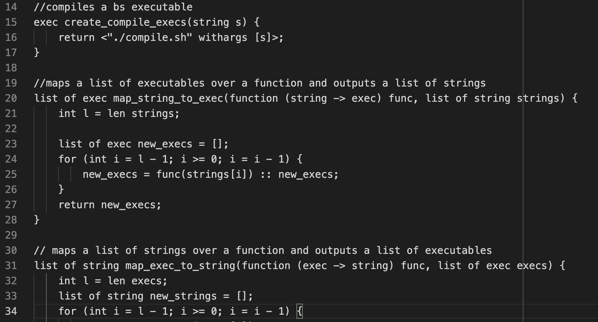
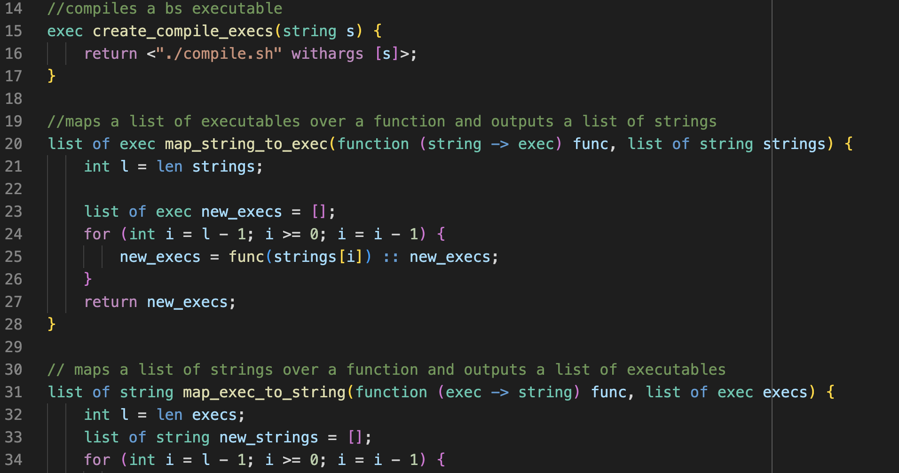

# BlueShell Extension

This extension provides syntax highlighting for the BlueShell programming
language. The extension works on files with the **.bs** file extension.
 
 

## Features 
### BlueShell without Syntax Highlighting 

### BlueShell with Syntax Highlighting 

## Installing BlueShell

To install the BlueShell compiler, see instructions at https://github.com/klin303/BlueShell

## Release Notes

### 1.0.0

Initial release of the BlueShell extension.

